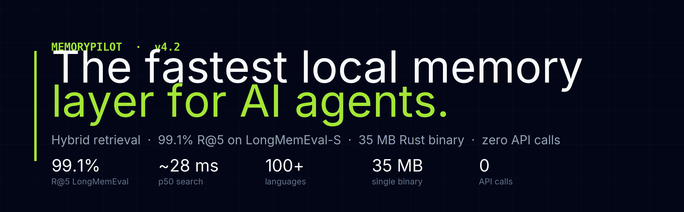

<p align="center">
  
</p>

<p align="center">
  <strong>The most advanced MCP memory server. Period.</strong><br>
  <sub>Hybrid search (BM25 + fastembed RRF) · Temporal Knowledge Graph · AAAK compression · GraphRAG · Chunked RAG · Auto-Linting · Project brain · HTTP API · Single binary</sub>
</p>

<p align="center">
  
  
  
  
  
</p>

---

## Why

AI coding assistants forget everything between sessions. MemoryPilot gives them persistent, searchable memory with project awareness, semantic understanding, and automatic knowledge organization.

**vs every other MCP memory server:**

| Feature | MemoryPilot v4.0 | MCP Memory (Node.js) | Other Rust/Python servers |
|---------|-----------------|----------------------|--------------------------|
| Search | Hybrid BM25 + fastembed RRF (384-dim transformers) | Unranked filter | BM25 only |
| Embeddings | fastembed all-MiniLM-L6-v2 (ONNX) + TF-IDF fallback | None | OpenAI API calls |
| Knowledge Graph | Temporal triples with validity periods + entity extraction | No | No |
| GraphRAG | Auto entity extraction + graph traversal + link boosting | No | No |
| Chunked RAG | Transcript auto-chunking + auto-distillation | No | No |
| Compression | AAAK compact dialect (~3x token savings) | No | No |
| Person detection | Auto-detects team members from text | No | No |
| Self-Healing | Background auto-linting loop | No | No |
| Garbage collection | Heuristic merge + scoring + orphan cleanup | No | TTL only |
| Project brain (<1500 tokens) | Yes, with team members | No | No |
| File watcher context boost | Yes | No | No |
| Deduplication | Content hash (exact) + Jaccard 85% (fuzzy) | No | Basic exact match |
| HTTP API | Multi-threaded REST server (optional) | No | No |
| Memory types | 13 types, importance 1-5 | 1 type | 2-3 types |
| Startup | 1-2 ms | 50-100 ms | 5-20 ms |
| Binary (default) | 22 MB (with ONNX embeddings) | 200 MB+ (node_modules) | 5-50 MB |
| Binary (lite) | 2.7 MB (TF-IDF only) | — | — |
| Storage | SQLite WAL + FTS5 + connection pool | JSON files | SQLite basic |
| Concurrency | Lazy embedding thread + read pool + debounced cleanup | Single-threaded | Single-threaded |

## The 8 Pillars

### 1. Hybrid Search (BM25 + fastembed RRF)

Every memory gets a 384-dimension embedding vector on insert via `fastembed` (all-MiniLM-L6-v2, local ONNX inference — no API calls). Search runs both BM25 full-text and cosine similarity in parallel, then merges results with Reciprocal Rank Fusion.

Results are boosted by importance weighting, knowledge graph link density, file watcher context, and penalized for expired knowledge triples.

**Performance optimizations:**
- Lazy embedding: `add_memory` returns instantly, embeddings computed in background thread
- LRU cache (64 entries): repeated search queries skip embedding computation
- Read connection pool (4 connections): concurrent vector searches don't block writes
- Content hashing (FNV-1a): backfill skips unchanged memories

### 2. Temporal Knowledge Graph

A full knowledge graph with temporal validity. Facts have `valid_from` / `valid_to` dates and `confidence` scores. When facts become outdated, they are invalidated rather than deleted — giving the AI a timeline of how knowledge evolved.

Entities (technologies, files, components, people) are automatically extracted from memory content and linked bidirectionally. Search results from memories with all-expired triples are penalized.

**5 dedicated KG tools:** `kg_add`, `kg_invalidate`, `kg_query`, `kg_timeline`, `kg_stats`

### 3. GraphRAG

Every memory is automatically analyzed for entities: technologies, file paths, components, projects, and **people**. Entities are stored in a dedicated table. Memories sharing entities are auto-linked with inferred relationship types (`resolves`, `implements`, `depends_on`, `deprecates`...).

When searching, MemoryPilot traverses the knowledge graph from the top matches to pull in related context — e.g., finding the architecture decision that led to a specific bug fix.

### 4. Chunked RAG (Transcripts)

Save full conversation transcripts without polluting the LLM context window. The `add_transcript` tool automatically chunks large texts into ~2000 character blocks and links them together. Chunks are excluded from `recall` but fully searchable.

Auto-distillation extracts structured memories from transcripts: `decision`, `preference`, `todo`, `bug`, `milestone`, `problem`, and `note`. Smart disambiguation: a segment mentioning both a bug and its resolution is classified as `milestone`, not `bug`.

Supports `session_id`, `thread_id`, `window_id` for multi-window memory scoping.

### 5. AAAK Compression

Inspired by MemPalace's symbolic memory language. When `compact: true` is passed to `recall` or `get_project_brain`, output is compressed ~3x using a terse, pipe-separated format:

```
[DEC:5] Use Clerk over Auth0 | tags:auth,stack | proj:MyApp
[PREF:4] Always use TypeScript strict mode | tags:typescript
```

### 6. Self-Healing (Auto-Linter)

MemoryPilot watches your files. When you save a Rust, Svelte, or TypeScript file, it lints in the background. Compilation errors are automatically stored as `bug` memories with the exact stack trace. When the error is fixed, the memory is auto-deleted.

The linter thread reuses a single DB connection for its entire lifetime.

### 7. Garbage Collection

Old, low-importance memories are scored for cleanup candidacy. Groups of related stale memories are merged into condensed summaries using heuristic keyword extraction. Orphaned links and entities are cleaned. DB is vacuumed after significant deletions.

### 8. Project Brain

One tool call returns a dense JSON snapshot of a project under 1500 tokens: tech stack, architecture decisions, active bugs, recent changes, key components, and **team members** (auto-detected person entities). Supports `compact: true` for AAAK compression.

## Install

### Default (with fastembed — recommended)

```bash
git clone https://github.com/Soflution1/MemoryPilot.git
cd MemoryPilot
cargo build --release
cp target/release/MemoryPilot ~/.local/bin/
chmod +x ~/.local/bin/MemoryPilot
xattr -cr ~/.local/bin/MemoryPilot  # macOS only
```

### Lite (TF-IDF only — 2.7 MB binary)

```bash
cargo build --release --no-default-features --features lite
```

### With HTTP server

```bash
cargo build --release --features http
```

### Cursor Integration (Zero-Config)

Add to `~/.cursor/mcp.json`:

```json
{
  "mcpServers": {
    "MemoryPilot": {
      "command": "/Users/you/.local/bin/MemoryPilot"
    }
  }
}
```

**That's it.** MemoryPilot automatically injects a dynamic System Prompt into Cursor and Claude Desktop on startup. The AI will proactively call `add_memory` in the background to store your architecture decisions, API keys, and bug fixes without manual intervention.

Or use via [McpHub](https://github.com/Soflution1/McpHub) for SSE transport with all your other MCP servers.

### First run

```bash
# If upgrading from v1 (JSON files):
MemoryPilot --migrate

# Compute embeddings for existing memories:
MemoryPilot --backfill

# Force re-embed all (skips unchanged via content hash):
MemoryPilot --backfill-force
```

## MCP Tools (28)

### Core

| Tool | Description |
|------|-------------|
| **`recall`** | Start here. Loads all context in one shot: project memories, scoped thread/window memories, preferences, critical facts, patterns, decisions, global prompt. Supports `mode = safe/default/full`, `compact = true` for AAAK compression. |
| **`get_project_brain`** | Instant project summary (<1500 tokens): tech stack, architecture, bugs, recent changes, components, team members. Supports `compact = true`. |
| **`search_memory`** | Hybrid BM25 + fastembed RRF search, boosted by importance, graph links, and file watcher context. Batched triple scoring. |
| **`get_file_context`** | Memories related to recently modified files in working directory. |

### Memory CRUD

| Tool | Description |
|------|-------------|
| `add_memory` | Store with lazy embedding, auto-dedup (hash exact + Jaccard 85%), auto entity extraction, auto graph linking. Importance 1-5, TTL. |
| `add_memories` | Bulk add multiple memories in one call with per-item dedup. |
| `add_transcript` | Store a long transcript as chunked archive, auto-distill structured memories (`decision`, `preference`, `todo`, `bug`, `milestone`, `problem`, `note`). |
| `get_memory` | Retrieve by ID. |
| `update_memory` | Update content, kind, tags, importance, TTL. Skips re-embedding if content unchanged (hash check). |
| `delete_memory` | Delete by ID (cascades to entities and links). |
| `list_memories` | List with project/kind filters and pagination. |

### Knowledge Graph

| Tool | Description |
|------|-------------|
| `kg_add` | Add a fact triple (subject → predicate → object) with optional validity period and confidence score. |
| `kg_invalidate` | Mark a triple as expired (sets `valid_to`), preserving history. |
| `kg_query` | Query all triples related to an entity, with temporal filtering and direction control. |
| `kg_timeline` | Chronological history of all triples involving an entity. |
| `kg_stats` | Summary statistics: total triples, active, expired, unique subjects/objects. |

### Project & Config

| Tool | Description |
|------|-------------|
| `get_project_context` | Full project context with preferences and patterns. |
| `register_project` | Register project with filesystem path for auto-detection. |
| `list_projects` | List projects with memory counts. |
| `get_stats` | DB statistics: totals, by kind, by project, DB size, hygiene signals. |
| `get_global_prompt` | Auto-discover GLOBAL_PROMPT.md from ~/.MemoryPilot/ or project root. |
| `export_memories` | Export as JSON or Markdown with importance stars. |
| `set_config` | Set config values (e.g. global_prompt_path). |

### Maintenance

| Tool | Description |
|------|-------------|
| `run_gc` | Garbage collection: merge old memories, clean orphans, vacuum. Supports `dry_run`. |
| `cleanup_expired` | Remove expired TTL memories (debounced — runs max once per 60s). |
| `benchmark_recall` | Recall quality benchmark with golden scenarios. |
| `migrate_v1` | Import from v1 JSON files. |

### Memory Types

`fact` · `preference` · `decision` · `pattern` · `snippet` · `bug` · `credential` · `todo` · `note` · `milestone` · `architecture` · `problem` · `transcript_chunk`

Each memory has importance (1-5), optional TTL, tags, project scope, content hash, and auto-generated embedding + entity links.

## CLI

```bash
MemoryPilot                          # Start MCP stdio server
MemoryPilot --backfill               # Compute missing embeddings
MemoryPilot --backfill-force         # Re-embed all (skips unchanged via hash)
MemoryPilot --benchmark-recall       # Run recall quality benchmark
MemoryPilot --http 7437              # Start HTTP REST server (requires --features http)
MemoryPilot --migrate                # Import v1 JSON data
MemoryPilot --version                # Show version
MemoryPilot --help                   # Show help
```

## HTTP API

When built with `--features http`, MemoryPilot exposes a multi-threaded REST API (4 worker threads, each with its own DB connection):

```bash
# Health check
curl http://localhost:7437/health

# Call any MCP tool
curl -X POST http://localhost:7437/tools/call \
  -H 'Content-Type: application/json' \
  -d '{"name": "search_memory", "arguments": {"query": "auth setup", "limit": 5}}'
```

## Architecture

```
src/main.rs        — CLI + MCP stdio server + file watcher init + HTTP server init
src/db.rs          — SQLite engine: hybrid search, CRUD, KG, GC, brain, recall, lazy embed, connection pool
src/tools.rs       — 28 MCP tool definitions + handlers
src/protocol.rs    — JSON-RPC types
src/embedding.rs   — Dual engine: fastembed (all-MiniLM-L6-v2) + TF-IDF fallback, LRU cache
src/graph.rs       — Entity extraction (tech, files, components, people) + relation inference + graph traversal
src/gc.rs          — GC scoring, heuristic memory merging, stopwords
src/watcher.rs     — File system watcher + auto-linter with persistent DB connection
src/http.rs        — Optional multi-threaded HTTP REST server (feature-gated)
```

### Database Schema

```sql
memories           — id, content, kind, project, tags, importance, embedding (BLOB),
                     content_hash, expires_at, last_accessed_at, access_count, metadata
memories_fts       — FTS5 virtual table (content, tags, kind, project)
memory_entities    — memory_id, entity_kind, entity_value, valid_from, valid_to
memory_links       — source_id, target_id, relation_type, valid_from, valid_to, confidence
knowledge_triples  — id, subject, predicate, object, valid_from, valid_to, confidence, source_memory_id
projects           — name, path, description
config             — key/value store
```

## Performance

| Metric | Default (fastembed) | Lite (TF-IDF) |
|--------|-------------------|----------------|
| Binary size | 22 MB | 2.7 MB |
| Startup | 1-2 ms | 1-2 ms |
| Search (hybrid RRF) | <2 ms | <1 ms |
| `add_memory` latency | <1 ms (lazy embed) | <1 ms (lazy embed) |
| Embedding quality | Transformer (384-dim, all-MiniLM-L6-v2) | TF-IDF (384-dim) |
| Backfill (1000 memories) | ~30s (skips unchanged) | ~1s |
| RAM | ~15 MB | ~5 MB |
| Read concurrency | 4 pooled connections | 4 pooled connections |
| Runtime dependencies | **None** (ONNX bundled) | **None** |

### Optimizations

- **Lazy embedding**: `add_memory` inserts with `NULL` embedding, background thread computes and updates asynchronously
- **Content hashing** (FNV-1a): `--backfill-force` skips memories whose content hasn't changed
- **LRU embedding cache** (64 entries): repeated search queries reuse cached embeddings
- **Read connection pool** (4 connections): concurrent vector searches don't block writes
- **WAL mode**: SQLite Write-Ahead Logging for concurrent read/write
- **Batched scoring**: knowledge triple counts and link boosts fetched in single queries, not N+1
- **Debounced cleanup**: expired memory cleanup runs max once per 60 seconds
- **Prepared statements**: graph traversal prepares SQL once, not per node

## Recall Benchmark

```bash
MemoryPilot --benchmark-recall --scenario-limit 12
```

Runs against your real memory base using `recall(explain=true)`.

Two layers:
- Fixed **golden** scenarios for stable, repeatable quality checks
- Generated fallback scenarios from the current memory base

Metrics:
- `top1_hit_rate`: expected memory appears first
- `top5_hit_rate`: expected memory in top 5
- `cross_project_leak_rate`: wrong-project memories leaking
- `credential_leak_rate_safe`: credentials leaking in `mode = safe`
- `explain_consistency_rate`: search score detail for debugging

## Storage

- Database: `~/.MemoryPilot/memory.db`
- Global prompt: `~/.MemoryPilot/GLOBAL_PROMPT.md`
- Fastembed model cache: `~/.fastembed_cache/` (downloaded on first run)

## License

Apache 2.0 — Built by [SOFLUTION LTD](https://soflution.com)
